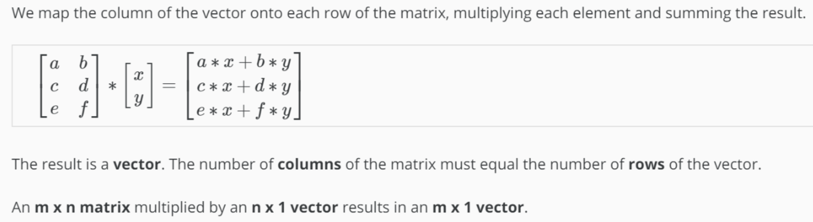
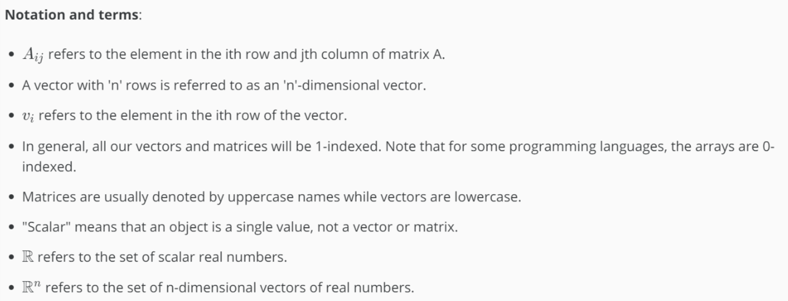

# Octave-Matrix Operating Note

BRICKEA
2019/3/9

## Basic operations

```octave

% The ; denotes we are going back to a new row.
A = [1, 2, 3; 4, 5, 6; 7, 8, 9; 10, 11, 12]

% Initialize a vector 
v = [1;2;3] 

% Get the dimension of the matrix A where m = rows and n = columns
[m,n] = size(A)

% You could also store it this way
dim_A = size(A)

% Get the dimension of the vector v 
dim_v = size(v)

% Now let's index into the 2nd row 3rd column of matrix A
A_23 = A(2,3)

% : means all elements along that row/column
A(2,:)

% Show the first and third rows elements
A([1 3],:)

% Like ++ operating
A = [A,[100,101,102]]

% Put all elements into one vector
A(:)

```

## Addition and scalar Multiplication

```ocatve
% Initialize matrix A and B 
A = [1, 2, 4; 5, 3, 2]
B = [1, 3, 4; 1, 1, 1]

% Initialize constant s 
s = 2

% See how element-wise addition works
add_AB = A + B 

% See how element-wise subtraction works
sub_AB = A - B

% See how scalar multiplication works
mult_As = A * s

% Divide A by s
div_As = A / s

% What happens if we have a Matrix + scalar?
add_As = A + s
```

## Matrix-Vector Matrix-Matrix Multiplication



```octave
% Initialize matrix A 
A = [1, 2, 3; 4, 5, 6;7, 8, 9] 

% Initialize vector v 
v = [1; 1; 1] 

% Multiply A * v
Av = A * v
```

## Properties

```octave
% Initialize random matrices A and B 
A = [1,2;4,5]
B = [1,1;0,2]

% Initialize a 2 by 2 identity matrix
I = eye(2)

% The above notation is the same as I = [1,0;0,1]

% What happens when we multiply I*A ? 
IA = I*A 

% How about A*I ? 
AI = A*I 

% Compute A*B 
AB = A*B 

% Is it equal to B*A? 
BA = B*A 

% Note that IA = AI but AB != BA
```

## Inverse and Transpose

```octave
% Initialize matrix A 
A = [1,2,0;0,5,6;7,0,9]

% Transpose A 
A_trans = A' 

% Take the inverse of A 
A_inv = inv(A)

% What is A^(-1)*A? 
A_invA = inv(A)*A

```

## Notation and terms



