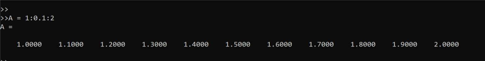

# Octave Basic Operating Note

BRICKEA
2019/3/9

## Things that learned from class

```octave

PS1('>>');  %Chang the front commend line to '>>'

disp(sprintf('Brickea %0.2f',a))    %Like C syntax to show something that you wang to show

format long     %Or short, you know, make the default display format to show more or less numbers

A = 1:0.1:2     %This means that we made a matrix, which stars from 1 and add 0.1 several times to 2.

```



```octave

ones(3,3)   %create a matrix with 3 rows and 3 columns, and all elements is 1

zeros(3,3)  %Same as function 'ones()'

rand(3,3)   %This will give you a 3 X 3 matrix with elements range in 0 to 1

randn(1,100000) %This will give you a random Gaussian distribution column vector with 100000 elements

hist(A,B)      %This will create a histogram of A with B rectangles

```

## How to moving data around

```octave

pwd     %Show the present file location

load filename    %load the file data to the octave

who     %Show all variables

whos    %Show not only all variables but also detials

save filename variable -ascii      %Save the variable as filename in the pwd (use ascii rule)

