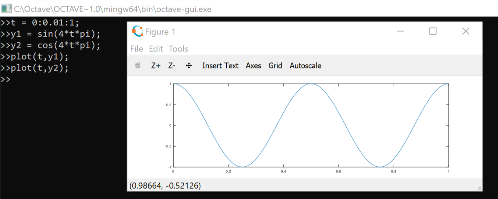
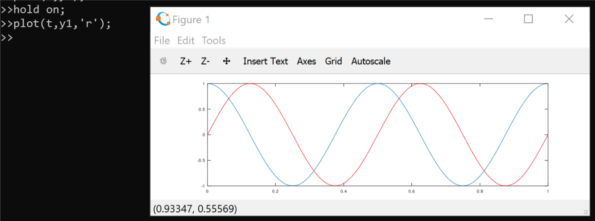
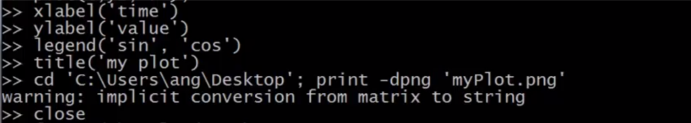
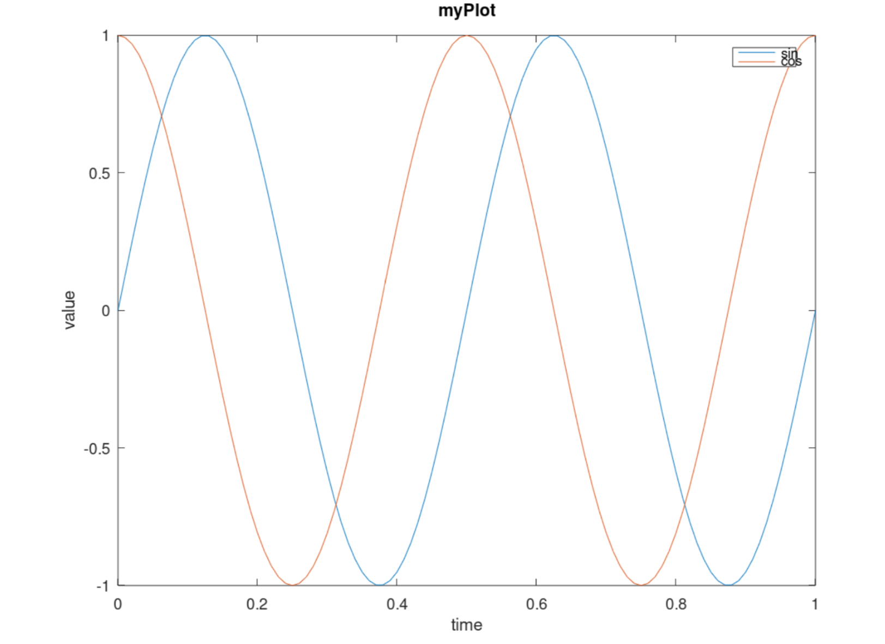
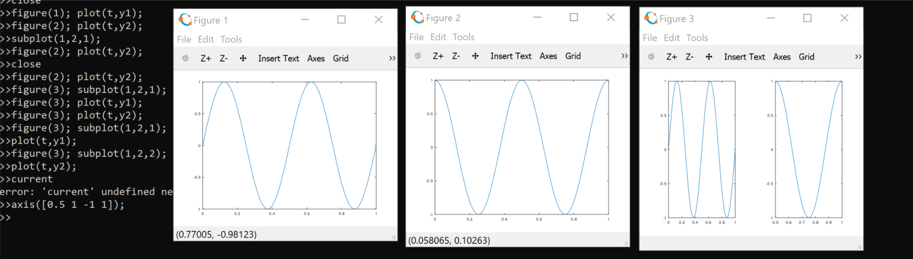
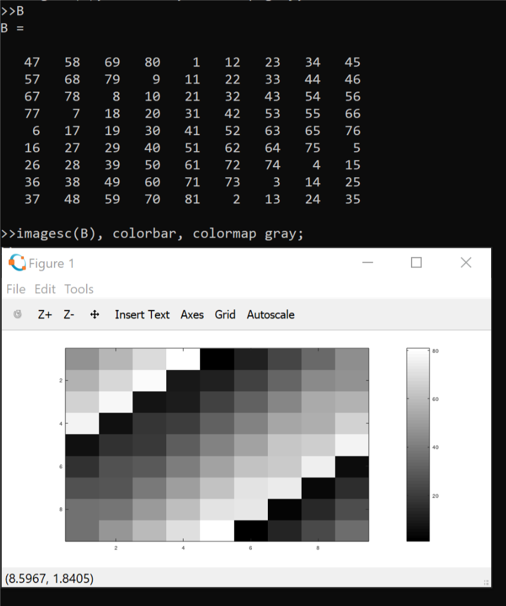

# Octave plot data

BRICKEA
2019/3/10

```octave

plot()      % This function will make the data
            % And the plot before will be replaced 
            % by the follow plot.

```



```octave

hold on     % This means use the figure 1 to show
            % the following operating.
```



```octave

xlabel('')
ylabel('')
legend('','')   % Label the line sequentially
title('')
print -dpng 'name.png'  % Save present figure to 
                        % the current file path. 
close           % Close the current figure
```





```octave

figure(1)       % Open a new figure with index 1
subplot(1,2,1)  % Divide a plot 1X2 grid, access
                % the first one
axis([0.5 1 -1 1])  % Change the x grid and y grid

clf             % Clean all chart in the current figure
```



```octave

imagesc(matrix)     % Visualize the matrix

imgaesc(matrix), colorbar, colormap gray;
                    % Use the gray colormap to
                    % visualize the matrix
```

